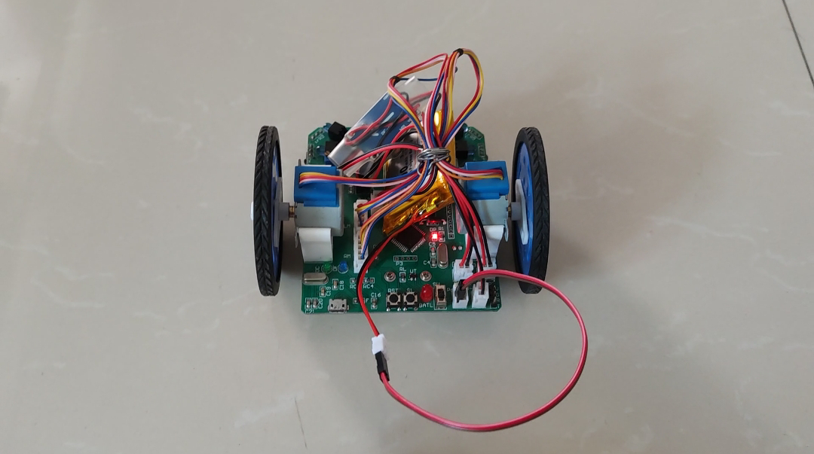

# C51_Maze_car
>  迷宫鼠，是使用嵌入式微控制器、传感器和机电运动部件构成的种智能行走装置（微型机器人），电脑鼠可以在不同“迷宫”中自动记忆和选择路径，采用相应的算法，快速地达到所设定的目的地。
电脑鼠是一个小型的由微处理器控制的机器人车辆，在复杂迷宫中具有导航的功能。要在指定的迷宫中比赛，如同一个人置身于竞赛，必须要靠本身的判断力、敏捷动作及正确探测周边环境，来赢得胜利。因此它必须具备自行决定搜寻策略，在迷宫中前进、转弯、记忆迷宫墙壁资料、计算最短路径和搜寻终点等功能。一般来说，一只电脑鼠需具备下列三个基本能力:
(1) 拥有稳定且快速的行走能力；
(2) 能正确判断环境能力；
(3) 记忆路径的能力。

### 设计目标
1. 从指定起点开在迷宫中行走，找到指定终点。
2. 从终点开始遍历迷宫返回起点，寻找最短路径。
3. 根据最短路径冲刺到终点。

### 总体架构设计
1. 微控制器
微控制器是电脑鼠的核心，可以选择单片机，若RAM需求量大或者算法复杂或者性能要求高时，需要使用ARM等高性能的微处理器。本书选定的微控制器为STC89C52单片机。
2. 电源系统电源用来为整个系统供电，由于是为系统中的每个模块供电，所以图中没有画出连线。选择哪种方式、使用哪种电池来供电，会将影响电路的设计。这里使用了升压供电方案。
3. 传感器及其驱动传感器的作用是用来感知环境，探测电脑鼠的左、前、右是否有路可走。本设计中采用的是红外传感器，发射和接收分别受微控制器控制。共有6组传感器，分别设置在电脑鼠头部的前左、前右、左、右、左前、右前方，其中左、右、前左、前右四组传感器是用于探测电脑鼠在当前迷宫格左、右、前三个方向上是否有支路的，左前、右前两组传感器呈45度安装，用于电脑鼠行进过程中的姿态矫正，防止电脑鼠走偏而撞到迷宫墙。由于6组传感器需要分时检测，某一时刻只能一组传感器工作，同时为了减少单片机控制传感器的引脚数,因此使用了3-8译码器来进行分时控制。
4. 电机及其驱动电路
驱动电路的作用是根据微控制器发过来的指令来驱动电机正/反转，带动轮子行走，从而完成电脑鼠走迷宫。驱动电路与所用电机密切相关，本设计采用的是步进电机。
5. 蜂鸣器当电脑鼠到达终点、或是返回到起点时，可以用蜂鸣器来提示，是电脑鼠的可选部分。
6. 显示器是用来显示当前位置等相关信息的，用于调试，是电脑鼠的可选部分。
7. 操作键电脑鼠上设计有操作按键，用于启动电脑鼠、对电脑鼠复位、控制充电等操作，是电脑鼠的可选部分。

### 效果图
